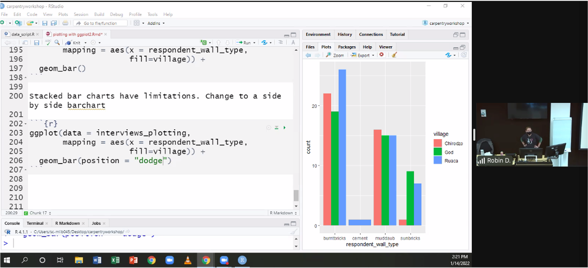

# Welcome to my Website

This website is a demo made for the carpentry workshop!!

I love R!!!

I love ggplot!!

I made a change.


```{r, echo = FALSE, message = FALSE, warning = FALSE}
## load the tidyverse
library(tidyverse)
library(here)

download.file("https://ndownloader.figshare.com/files/11492171", "data/SAFI_clean.csv", mode = "wb")
```

```{r, echo = FALSE, message = FALSE, warning = FALSE}
interviews <- read_csv(
  here("data", "SAFI_clean.csv"), 
  na = "NULL")
```

```{r, echo = FALSE, message = FALSE, warning = FALSE}
library(ggplot2)
```

```{r, echo = FALSE, message = FALSE, warning = FALSE}
interviews_plotting <- interviews %>%
  ## pivot wider by items_owned
  separate_rows(items_owned, sep = ";") %>%
  ## if there were no items listed, changing NA to no_listed_items
  replace_na(list(items_owned = "no_listed_items")) %>%
  mutate(items_owned_logical = TRUE) %>%
  pivot_wider(names_from = items_owned, 
              values_from = items_owned_logical, 
              values_fill = list(items_owned_logical = FALSE)) %>%
  ## pivot wider by months_lack_food
  separate_rows(months_lack_food, sep = ";") %>%
  mutate(months_lack_food_logical = TRUE) %>%
  pivot_wider(names_from = months_lack_food, 
              values_from = months_lack_food_logical, 
              values_fill = list(months_lack_food_logical = FALSE)) %>%
  ## add some summary columns
  mutate(number_months_lack_food = rowSums(select(., Jan:May))) %>%
  mutate(number_items = rowSums(select(., bicycle:car)))
  
```


* Adding Violin layer 

```{r, echo = FALSE, message = FALSE, warning = FALSE}
ggplot(data = interviews_plotting, 
    aes(x = village, y = rooms))  +
    geom_jitter(alpha = 0.5, width = 0.2, height = 0.2) +
      geom_violin(alpha = 0, color = "green")
```


* add color to the data points on the boxplot according to weather the respondant is a member of an irrigation association (memb_assoc)


```{r, echo = FALSE, message = FALSE, warning = FALSE}
ggplot(data = interviews_plotting, 
    aes(x = respondent_wall_type, y = liv_count))  +
    geom_boxplot() + 
    geom_jitter(aes(color=memb_assoc), alpha = 0.5, width = 0.2, height = 0.2) 
```


## Awsome Workshop




